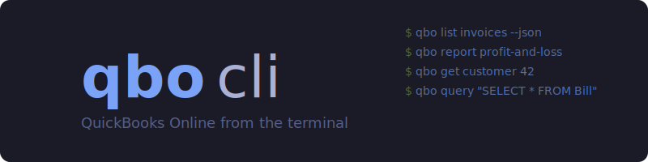

<p align="center">
  
</p>

<p align="center">
  <a href="https://github.com/voska/qbo-cli/actions/workflows/ci.yml"></a>
  <a href="https://github.com/voska/qbo-cli/releases"></a>
  <a href="https://go.dev/"></a>
  <a href="LICENSE"></a>
</p>

CLI for [QuickBooks Online](https://developer.intuit.com/app/developer/qbo/docs/api/accounting/most-commonly-used/account) — CRUD, reports, queries, and batch ops from the terminal.

### Highlights

- **Direct API access** — thin wrapper over the QBO REST API, no scraping or browser automation
- **Agent-friendly** — `--json` on every command, structured exit codes, stderr-only progress
- **Full CRUD** — list, get, create, update, delete any QBO entity plus raw queries
- **Financial reports** — profit & loss, balance sheet, and more with date range filters
- **Single binary** — install via Homebrew, Scoop, or `go install`

<p align="center"></p>

```bash
$ qbo list invoices --where "Balance > '0'" --sandbox --json
[
  {"Id": "130", "DocNumber": "1038", "CustomerRef": {"name": "Amy's Bird Sanctuary"}, "Balance": 629.10},
  {"Id": "131", "DocNumber": "1039", "CustomerRef": {"name": "Bill's Windsurf Shop"}, "Balance": 239.00}
]

$ qbo report profit-and-loss --start-date 2025-01-01 --sandbox
Profit and Loss (2025-01-01 — 2025-12-31)
──────────────────────────────────────────
  Income                          $12,450.00
  Cost of Goods Sold               $4,200.00
  ─────────────────────────────────
  Gross Profit                     $8,250.00
  Expenses                         $3,100.00
  ─────────────────────────────────
  Net Income                       $5,150.00
```

## Install

**Homebrew** (macOS / Linux):

```bash
brew install voska/tap/qbo
```

**Scoop** (Windows):

```powershell
scoop bucket add voska https://github.com/voska/scoop-bucket
scoop install qbo
```

<details>
<summary>Other install methods</summary>

**Go**:

```bash
go install github.com/voska/qbo-cli/cmd/qbo@latest
```

**Binary**: download from [Releases](https://github.com/voska/qbo-cli/releases).

**Linux (deb)** — also available for arm64:

```bash
curl -LO https://github.com/voska/qbo-cli/releases/latest/download/qbo_linux_amd64.deb
sudo dpkg -i qbo_linux_amd64.deb
```

</details>

## Quick Start

```bash
export QBO_CLIENT_ID=your_client_id
export QBO_CLIENT_SECRET=your_client_secret

# Authenticate (sandbox)
qbo auth login --sandbox

# Verify connection
qbo auth status
qbo company info --sandbox --json

# List invoices
qbo list invoices --sandbox

# Get a specific customer
qbo get customer 123 --sandbox

# Query with filters
qbo list invoices --where "Balance > '0'" --sandbox --json

# Run a report
qbo report profit-and-loss --start-date 2025-01-01 --end-date 2025-12-31 --sandbox
```

## Agent Skill

Install as a [Claude Code skill](https://docs.anthropic.com/en/docs/agents-and-tools/claude-code/skills) for AI-assisted QuickBooks workflows:

```bash
npx skills add -g voska/qbo-cli
```

The skill includes setup guidance, usage patterns, troubleshooting, and a full command reference.

## Getting Credentials

You need an Intuit Developer account to get OAuth credentials.

1. Sign up at [developer.intuit.com](https://developer.intuit.com) and create an app.
2. Select **QuickBooks Online and Payments** as the platform.
3. Under **Keys & credentials**, grab your **Client ID** and **Client Secret**.
4. Add a **Redirect URI** — `http://localhost:8844/callback` for sandbox, or a public URI for production.

See [Intuit's OAuth 2.0 guide](https://developer.intuit.com/app/developer/qbo/docs/develop/authentication-and-authorization/oauth-2.0) for the full walkthrough.

> **Sandbox vs Production:** Development keys only work with sandbox companies. For production, complete Intuit's app assessment and use `--redirect-uri` (or `QBO_REDIRECT_URI`) with a public URI.

## API

Uses the [QuickBooks Online Accounting API](https://developer.intuit.com/app/developer/qbo/docs/api/accounting/most-commonly-used/account) via REST. Requires OAuth 2.0 credentials from an Intuit Developer app. Sandbox access is free with no rate limits.

## Commands

| Command | Description |
|---------|-------------|
| `auth login\|logout\|status\|refresh` | OAuth 2.0 authentication |
| `list <entity>` | List entities with optional `--where` filter |
| `get <entity> <id>` | Read a single entity by ID |
| `create <entity> --data <json>` | Create an entity from JSON |
| `update <entity> --data <json>` | Update an entity |
| `delete <entity> <id>` | Delete an entity by ID |
| `query "<sql>"` | Raw QBO query |
| `report <type>` | Financial reports (profit-and-loss, balance-sheet, etc.) |
| `batch --file <path>` | Batch operations from file |
| `cdc --entities --since` | Change data capture polling |
| `company info\|list\|switch` | Company management |
| `schema` | CLI command tree as JSON (agent introspection) |
| `exit-codes` | Print exit code reference |

All commands support `--dry-run`, `--no-input`, and `--sandbox`.

## Output Modes

| Flag | Description |
|------|-------------|
| _(default)_ | Colored tables, summaries on stderr |
| `--json` / `-j` | Structured JSON to stdout |
| `--plain` / `-p` | Tab-separated values, no color |
| `--results-only` | Strip pagination metadata |
| `--select f1,f2` | Project output to specific fields |

Auto-JSON: when stdout is not a TTY and `QBO_AUTO_JSON=1`, defaults to JSON output.

## Exit Codes

| Code | Name | Description |
|------|------|-------------|
| 0 | `success` | Operation completed successfully |
| 1 | `error` | General error |
| 2 | `usage` | Invalid usage or arguments |
| 3 | `empty` | No results found |
| 4 | `auth_required` | Authentication required or token expired |
| 5 | `not_found` | Resource not found |
| 6 | `forbidden` | Permission denied |
| 7 | `rate_limited` | API rate limit exceeded |
| 8 | `retryable` | Transient error, safe to retry |
| 10 | `config_error` | Configuration error |

## Development

```bash
make build    # Build to bin/qbo
make test     # Run tests with race detector
make lint     # golangci-lint
make vet      # go vet
make fmt      # gofmt
make ci       # fmt + lint + vet + test + build
```

## License

MIT
